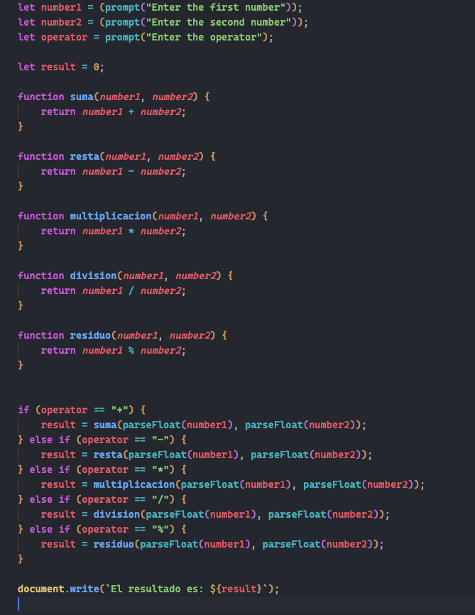

# Javascript - Ejercicios

## 1. Calculadora (calculadora.js)
    Escribe un programa en JavaScript que funcione como una calculadora básica. El programa debe pedir al usuario que ingrese dos números y una operación (suma, resta, multiplicación, división o módulo). Luego, debe realizar la operación y mostrar el resultado.
    Requisitos:
    - Pedir al usuario que ingrese el primer número.
    - Pedir al usuario que ingrese el segundo número.
    - Pedir al usuario que ingrese la operación a realizar (puede ser +, -, *, /, %).
    - Utilizar una estructura condicional (if, else if, else) para realizar la operación correspondiente.

    - Mostrar el resultado de la operación.

## 2. Gestion de información de un objeto

    - Crear un objeto persona con propiedades básicas.
        El objeto persona se creara inicialmente con las siguentes propiedades:
        nombre  : Luis
        apellido: Cerna
        edad    : 34
        telefono: 123456789
    - Acceder y mostrar propiedades del objeto.

    - Añadir un objeto anidado dentro de persona.

    - Agregar y eliminar propiedades del objeto.

    - Usar la destructuración para acceder a propiedades.

    - Congelar el objeto para evitar cambios.

    - Sellar el objeto para permitir modificaciones.

    - Unir dos objetos usando Object.assign y el operador spread.

    - Usar this dentro de un método del objeto.

    - Recorrer el objeto usando Object.keys, Object.values y Object.entries.

    - De ser posible usar funciones con parámetros y con devolución (return)
Se realizó una modificación al ejercicio 1 (calculadora) para que utilice funciones para cada operación, quedando de la siguente manera:

